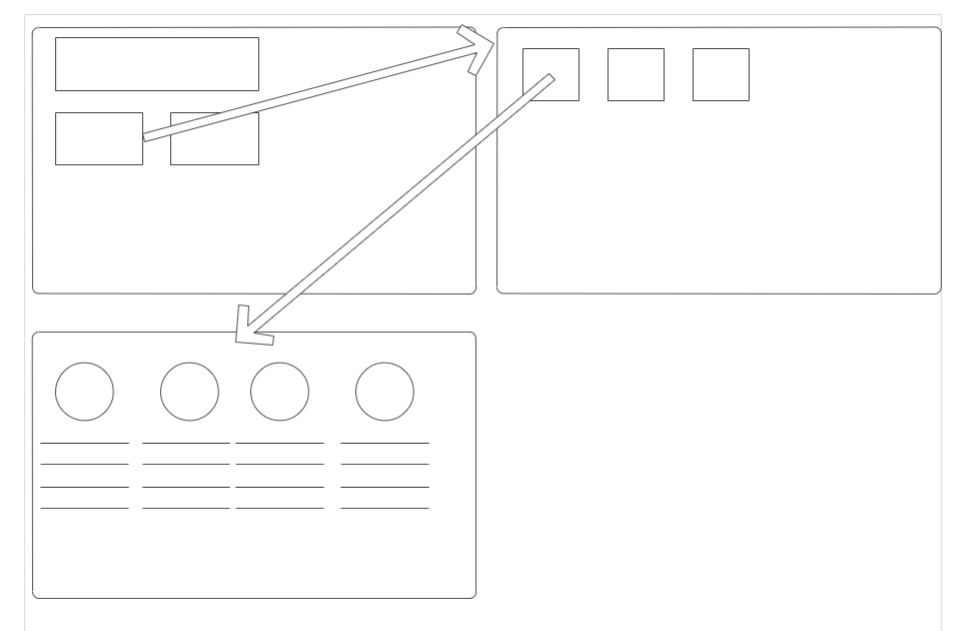

1. 登录页面
    1. table
2. 注册页面
    1. table
    2. 确认密码需要和密码一致
3. 挑选货物页面，可放入购物车
    1. 需要知道是谁进入了该页面，从而知道插入购物车的时候带上谁的印记
    2. 需要循环展示货物(名称、描述、图片、价格、数量)
    3. 需要可以放入购物车
   思路(不同页面用各自的父子关系传值连接！)：
   
4. 购物车页面，可下订单
5. 订单详情页面，可查看物流进度（统一为“已下单未发货”）

